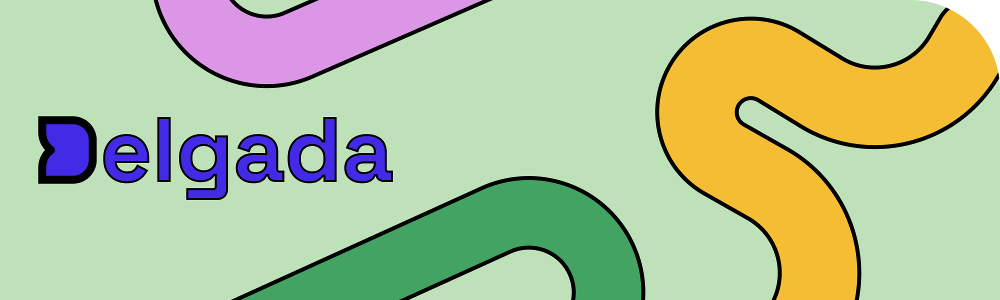

<p align="center">
  <a href="https://delgada.dev" target="_blank" rel="noopener noreferrer">
    
  </a>
</p>

[](https://www.npmjs.com/package/delgada)
[](./LICENSE)

❗️ Warning: This is not production-ready software. ❗️

## What is Delgada?

Delgada is a frontend web framework for building slim multipage websites using modern web standards and conventions.

Features include:

- File-system based routing
- Create pages using JavaScript or Markdown
- Web components as a first class citizen – bring your own framework (or none at all)!
- Single file static components
- Flexible page templates
- SEO friendly final build

## Getting Started

To quickly get up and running you can install the [project template](https://github.com/delgada-ui/template) to scaffold out a new website.

```
npx degit delgada-ui/template my-delgada-project
cd my-delgada-project
npm install
npm run build
npm start
```

## Documentation

Read a [high level overview](./docs/overview.md) of the current syntax and functionality available in Delgada.

## License

[MIT](LICENSE)
